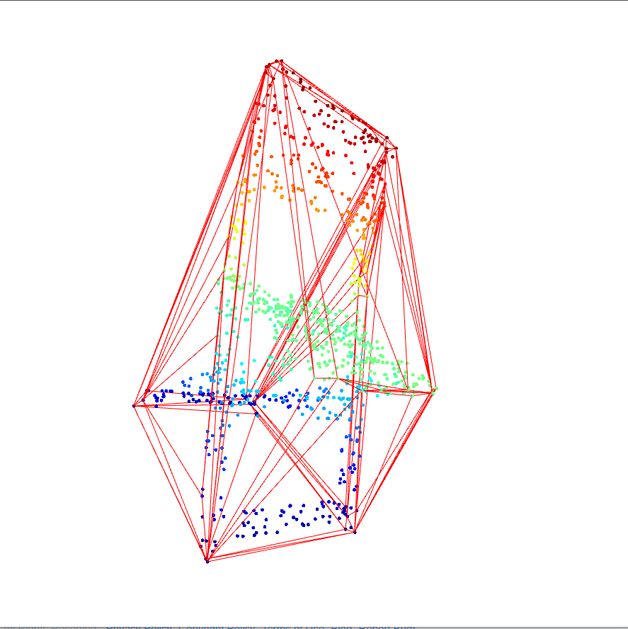
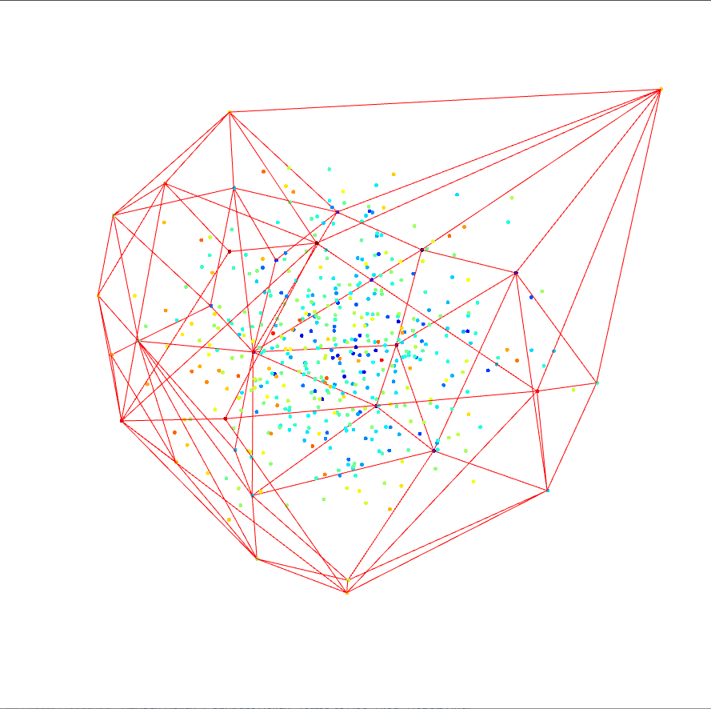

# CS271 Spring 2021 Computer Graphics II

# HomeWork 1

**Name:** **任怡静**

**Student ID:2018533144**

**E-mail: renyj@shanghaitech.edu.cn**

### Problem 1: 3D convex hull algorithm

##### Implement a 3D convex hull algorithm (not limited to the ones in slides) with visualization. 

###### Data Structures

- For the input of 3D point cloud, the data structure looks like this:

- ```python
  class Point3D:
      def __init__(self,x,y,z):
          self.m_x = x
          self.m_y = y
          self.m_z = z
      def DotProduct(self, other):
          return self.m_x * other.m_x + self.m_y * other.m_y + self.m_z * other.m_z
      def CrossProduct(self, other):
          coord_x = self.m_y * other.m_z - self.m_z * other.m_y
          coord_y = self.m_z * other.m_x - self.m_x * other.m_z
          coord_z = self.m_x * other.m_y - self.m_y * other.m_x
          result = Point3D(coord_x, coord_y, coord_z)
          return result
      def Minus(self,other):
          p = Point3D(0,0,0)
          p.m_x = self.m_x - other.m_x
          p.m_y = self.m_y - other.m_y
          p.m_z = self.m_z - other.m_z
          return p
  ```

  - Members
    - In this data structure, **m_x**,  **m_y**, **m_z** represent the three dimensional coordinate for a 3D point or vector, all three of them are type **double**
  - Functions
    - The **Point3D** class support dot product, cross product and vector calculation

- For the Faces generated by algorithm for convex hull, the data structure looks like this:

- ```python
  class Face:
      def __init__(self, x, y, z, h):
          self.is_hull = h
          self.v1 = x
          self.v2 = y
          self.v3 = z
  ```

  - Members
    - **v1**, **v2**, **v3** represent the order of a face, if read in order, it will make sure it is always counterclockwise, all three of them are type **int**

- For final formed convex hull, the data structure looks like this:

- ```python
  class Convex3D:
      points = []
      def __init__(self):
          self.triangleF = []
      def DirectedVolume(self, p, f):
          vector1 = Point3D.Minus(self.points[f.v2], self.points[f.v1])
          vector2 = Point3D.Minus(self.points[f.v3], self.points[f.v1])
          vector3 = Point3D.Minus(p, self.points[f.v1])
          return Point3D.DotProduct(Point3D.CrossProduct(vector1, vector2), vector3)
      def CreateOriginTetrahedron(self):
          if len(self.points) < 4:
              print("Not enough points for 3D convexhull")
              return None
          success = False
          for i in range(1, len(self.points)):
              if Dist(self.points[0], self.points[i]) > ERROR:
                  self.points[1],self.points[i] = self.points[i], self.points[1]
                  success = True
                  print("Find two points")
                  break
          if not success:
              print("Same vertex for all in list")
              return None
          success = False
          for i in range(2, len(self.points)):
              if Area(self.points[0],self.points[1],self.points[i]) > ERROR:
                  self.points[2], self.points[i] = self.points[i], self.points[2]
                  success = True
                  print("Find three points")
                  break
          if not success:
              print("Same line for all in list")
              return None
          for i in range(3, len(self.points)):
              if Volume(self.points[0], self.points[1], self.points[2], self.points[i]) > ERROR:
                  self.points[3], self.points[i] = self.points[i], self.points[3]
                  success = True
                  print("Find Four Points")
                  break
          if not success:
              print("Same plane for all in list")
              return None
          else:
              originConv = Convex3D()
              for i in range(4):
                  face_tmp = Face((i+1)%4,(i+2)%4,(i+3)%4,True)
                  if self.DirectedVolume(self.points[i], face_tmp) > 0:
                      face_tmp.v2, face_tmp.v3 = face_tmp.v3, face_tmp.v2
                  originConv.triangleF.append(face_tmp)
              return originConv
      def CleanUp(self, insideFaces):
          insideF = []
          outsideF = []
          for face in insideFaces:
              insideF.append((face.v1, face.v2))
              insideF.append((face.v2, face.v3))
              insideF.append((face.v3, face.v1))
  
              outsideF.append((face.v2, face.v1))
              outsideF.append((face.v3, face.v2))
              outsideF.append((face.v1, face.v3))
          insideF = set(insideF)
          outsideF = set(outsideF)
          return insideF - outsideF
          
      def AddPointP(self, hull, p):
          visibleF = []
          for face in hull.triangleF:
              if self.DirectedVolume(self.points[p], face) > ERROR:
                  visibleF.append(face)
          for face in visibleF:
              hull.triangleF.remove(face)
          for edge in self.CleanUp(visibleF):
              newFace = Face(edge[0], edge[1], p, True)
              hull.triangleF.append(newFace)
      def ExtendConvexHull(self):
          hull = self.CreateOriginTetrahedron()
          if hull is not None:
              for i in range(4, len(self.points)):
                  self.AddPointP(hull, i)
          return hull
  ```

  - Members
    - **points** is the list of points read from input, prepare for calculation, type **List<Point3D>**
    - **triangleF** is the list of faces calculated by **Convex3D** functions, will be updated if some faces are covered by others, type **List<Face>**
  - Functions
    - **DirectedVolume()** will calculate the directed volume of point **p** and face **f**, return **double**
    - **CreateOriginTetrahedron()** will form the original tetrahedron for incremental algorithm, it will check through **points** list and find the first four points that are not in the same plane, and push four faces into **triangleF**, will return **None** if tetrahedron not formed, otherwise return **self**
    - **CleanUp()** will clean up the faces that has been covered during updating faces from old convex hull, saving only edges that need not be ignored
    - **AddPointP()** will add point **p** to old convex hull **hull**, remove covered faces, add new faces to **triangleF**
    - **ExtendConvexHull()** will extend and return the final hull **hull**, type **Convex3D**

###### Visualization Examples

- Point cloud for models, 1000 points

<figure class="half">
    
</figure>

- Random point cloud, 50 points, 500 points, 2000 points

<figure class="half">
    
</figure>

##### Time complexity and runtime with incremental number of points

- The time complexity of the algorithm is O(n^2)

  - For **ExtendConvexHull()**, since we need to iterate through all vertices of previous convex hull, we will have the following growth in iteration:

  - $$
    O(3+4+...+n) = O(n^2)
    $$

  - For other parts of the algorithm, the time complexity all are smaller than O(n^2)

  - Thus time complexity is O(n^2)

- Runtime within incremental of points, 10 points, 100 points, 1000 points, 10000 points

  - 10 points: 0.0003941059112548828 s
  - 100 points: 0.024116039276123047 s
  - 1000 points: 0.339540958404541 s
  - 10000 points: 4.90024995803833 s