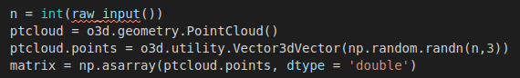
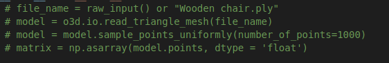
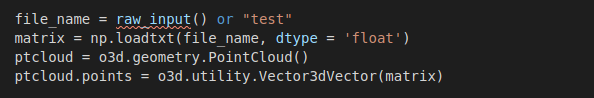
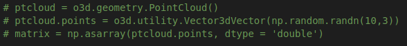

# CS271 Spring 2021 Computer Graphics II

# HomeWork 1

**Name:** **任怡静**

**Student ID:2018533144**

**E-mail: renyj@shanghaitech.edu.cn**

### Problem 1: 3D convex hull algorithm

##### Package and Environment

- The convex hull algorithm is realized using language **Python**
- The visualization uses the python package of **Open3D**
- **Python 2.7.18** by anaconda is used in the project as environment, need to install **Open3D** package, consult http://www.open3d.org/ for installation

##### Instructions

- Run the code by using `python convexHull.py`
- There are two kinds of input ways:
  - Default way: Use the code below to run the code, input an **int** to console and wait for the result
    - 
  - Model input: Use the code below to run the code, input a **string** (including the file's suffix) into console and wait for the result,or just press enter to get the default polymodel of a chair
    - 

##### Output

- It will output a window that contains **lines** of convex hull and the origin point cloud, drag the cursor to rotate, scroll roll to scale, and hold down roll to move vision
- It will output **runtime** in seconds on the console

### Problem 2: Collision Detection for two convex hulls

##### Package and Environment

- The convex hull algorithm is realized using language **Python**
- The visualization uses the python package of **Open3D**
- **Python 2.7.18** by anaconda is used in the project as environment, need to install **Open3D** package, consult http://www.open3d.org/ for installation
- An extra version of using package **Shapely** is provided for suppliment, it can be installed by command `pip install Shapely`

##### Instructions

- Run the code by using `python collisionDetection.py`
- There are two kinds of input ways:
  - Default way: Use the code below to run the code, input two **strings** (including the file's suffix) to console and wait for the result
    - 
      - type in `test`, `test2` to see Testcase 6 in Design Doc
      - type in `test.txt`, `test2.txt` to see Testcase 1 in Design Doc
      - type in `test.txt`, `test3.txt` to see Testcase 4 in Design Doc
      - type in `test.txt`, `test4.txt` to see Testcase 5 in Design Doc
      - type in `test.txt`, `test5.txt` to see Testcase 2 in Design Doc
      - type in `test.txt`, `test6.txt` to see Testcase 3 in Design Doc
  - Random input: Use the code below to run the code, just start the program and wait for the result
    - 
- For supplement code `collisionDetectionPac.py`, run it with  `python collisionDetectionPac.py`, use default input way, it has flaws that it cannot detect if one convex hull has only one vertex/one edge/one plane collided, or one convex hull completely encircle another convex hull

##### Output

- It will output a window that contains **lines** of the two convex hulls and the origin point clouds, drag the cursor to rotate, scroll roll to scale, and hold down roll to move vision
- It will output "Collide" or "No collision " **string** on the console, representing two hulls collides or don't collide

##### Notice

- In convex hull detection problem, I consider only one vertex/edge/plane collides is not collision, only the two convex hulls intersect with each other will be considered as collisions

