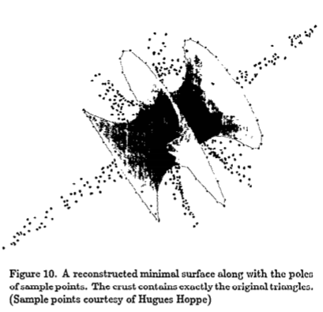

# Research Survey for the Surface Reconstruction Using Delaunay Triangulation

#### Paper Title and link

**Surface reconstruction by Voronoi filtering**, https://dl.acm.org/doi/10.1145/276884.276889

#### Retell the paper

##### Background

Under the large amount of requirements of point cloud reconstruction in computer graphics, medical imaging and cartography, and as Hoppe et al.'s algorithm for the reconstruction brings the problem to the attention of the computer graphics community, the research thrives in this area.

At that time, papers mainly gives heuristic solutions, a few papers provide reconstruction solutions without firm guarantee on accuracy and completeness (Hoppe et al., Curless and Levoy), and few papers offer two dimensional reconstruction algorithm with guarantees (α-shape of Edelsbrunner et al., Euclidean minimum spanning tree). On the purpose of giving an algorithm that is both steady and extensible to higher dimension, this paper is written.

The algorithm of this paper relies on an older algorithm, **Boissonnat's algorithm**, which gives a good instruction that "sculpts" the interior of a geometry with a subset of Delaunay tetrahedra. This gives the first observation for the algorithm that typical Delaunay tetrahedra possesses  circumspheres approximating maximal empty balls whose center is at the points of medial axis. And by correcting Boissonnat's mistake of not considering dense sample sets being able to give Delaunay tetrahedra with circumspheres that are arbitrarily far from the medial axis, the paper obtains its second observation and propose the crucial definition of poles.

##### Method description

- In this paper, the reconstruction process is specified as follows: 
  - Input: A set of point **S** sampled from the original two-dimensional manifold **F** in three dimensional space
  - Output: A triangular mesh **F'** which possesses **S** as its vertex set, and can converge to **F** in tolerable error.
- The algorithm and some explanations:
  - The algorithm is an extension of points reconstruction algorithm **CRUST** published by one of the authors Amenta. It first uses Voronoi to approximate the MAT of sample points **S**, then according to duality, applies the Delaunay to recover the surface of points. The algorithm in this paper gives its innovations on dealing with dense samples by bringing up a new concept "**poles**", which is a correction for over-sensitive areas (the dense sampled point areas). By using poles set **P** instead of using Voronoi graph **V** in **CRUST** with sample points **S** to reconstruct the surface, the new algorithm makes sure the surface in dense-sampled areas acceptably smooth. When finish filtering with both Voronoi and normals, almost all the lumps on the surface will be gone.
  - When the samples are dense, the Voronoi cell of every sample is **long and skinny**, and they are perpendicular to the surface, thus the two ends at the long skinny direction of Voronoi cell may be too far away from the medial axis, causing the lumps on surface. It is **poles**' job to make corrections to those Voronoi vertices in dense areas.
  - The pseudo code turns out to look like this:
    - Find out the Voronoi diagram for sample points **S**
    - Then traverse through **S**, for point **s** in **S**:
      - If **s** is not on the convex hull of **S** (meaning **s** is not a sample point in an open Voronoi cell), select the Voronoi point **p+** that fulfills: **p+** belongs to Voronoi(**s**), and Distance(**p+**, **s**) is the maximum.
      - If **s** is on the convex hull of **S** (meaning **s** is a sample point in an open cell of Voronoi), select the point **p+** that fulfills: **p+** is at infinite distance outside the convex hull, and the direction of vector **sp+** is Average of outward normals of all hull faces containing **s**.
      - When picked **p+**, pick another pole **p-** to be the projection on negative direction of vector **sp+**.
    - Collect all **p+** and **p-** except the ones that are at infinite distance to form a set **P**, apply the Delaunay triangulation of **S AND P**.
    - Remove the triangles that contains points that do not belong to **S**. (**Voronoi Filtering**)
    - Calculate the angle formed by the normal of triangle face **T** and vector to **p+** from one of the vertex of **T**, if the largest of three angles is bigger than predefined value θ (or 2.2θ for other two angles), delete **T**. (**Filtering by normal**)
    - Orient triangles and poles in order and extract the final result of surface without sharp dihedral angles, it should not be used in reconstructing surface with boundaries. (**Trimming**)

##### The results based on my own understanding for the paper

The algorithm stands out for the good effect of smoothness in reconstruction process, its unique method of using poles to filter over-dense errors or even noise make great contribution to the research of surface reconstruction. The algorithm also has some robustness for closing up surfaces in free space. (see the left figure below) 

However, it faces some challenges when the amount of sample points is too small. Although the **Voronoi Filtering** and **Filtering by normal** will help to remove extra lumps or wrong links within or between models, they can be over reacting when a sufficiently small r occurs for an r-sample, failing to close up polygon holes and forming some sharp corners at the edges. (see the right figure below) 

<figure class="half">
    
</figure>

#### My own analysis

##### Pros and cons

###### Pros

- Compared to other algorithms at the same time, it had made great progress in obtaining smooth and accurate surface for many point clouds.
- The algorithm has good robustness in input. It can accept samples whose points spread evenly in the original model space and also samples whose points distributes nonuniformly, which is a great progress considering the actual sampling situation.
- The algorithm has good robustness in output. Even it is not designed to do closure for open surfaces, it can still give out a satisfying result when dealing with these kind of data. The two filtering process also performs perfectly when facing some extra links between parted models or burrs and lumps in models.

###### Cons

- Although the algorithm works fine with most of the point clouds, the calculation of Voronoi diagrams is very costly, unfortunately the algorithm doesn't mention any optimizations on Voronoi calculations, thus when facing point clouds with large quantity, the algorithm may be very slow or even fails to handle data.
- The algorithm does well on reconstructing smooth surface, but sample sets with sharp corners will receive bad results including losing correct triangles, getting burrs and so on.

##### The comparison with other related methods

α-shapes: Like this algorithm, it is a subcomplex  of the Delaunay, a Delaunay simplex belongs to the α-shape of S if its circumsphere has radius at most α. The major flaw of using α-shapes for surface reconstruction is that the optimal value of α depends on the sampling density, which often varies over different parts of the surface.

Euclidean minimum spanning tree: can be used to reconstruct uniformly sampled curves in the plane. (Figueiredo and Miranda Gomes)

##### The future work

- There are two ways for two dimensional curve reconstruction: CRUST(Voronoi filtering) and β-skeleton. In this paper CRUST has been proved to have guaranteed reconstruction quality for three dimensional point cloud reconstruction, it is worth trying to also extend β-skeleton for surface reconstruction.
- Currently the reconstruction is limited to three dimensional, it is worthwhile to extend the algorithm to k-dimension.
- The numbers of sampling points and the universal limitation value of θ for **Filtering by normal** which can promise to give reliable results are not sure, it still needs more experiments and proofs.
- The algorithm is oriented for smooth surfaces, researches on whether CRUST can be used on reconstructing point clouds with hard corners (like machine parts) will be very contributive.
- The cost of the algorithm is rather high, if some optimizations are made for the algorithm, the algorithm will be able to handle larger point clouds.

