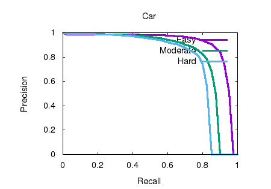
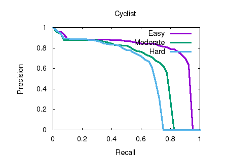
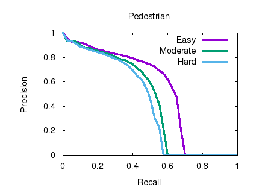

# Research Survey for PV-RCNN: Point-Voxel Feature Set Abstraction for 3D Object Detection

#### Paper Title and link

**PV-RCNN: Point-Voxel Feature Set Abstraction for 3D Object Detection**, https://arxiv.org/pdf/1912.13192v1.pdf

#### Retell the paper

##### Background

In the past few years, the rise of autonomous driving and robotics has drawn great attention to 3D object detection. Plenty of methods has already been brought up to serve for realization of detections towards different specific needs, but the updates in hardware provides scientists with more datasets and uncertain factors and the old methods cannot fulfill the needs. Under this condition, the team in this paper propose a new delegate framework.

Before this paper, the main stream method for detections could be classified to two categories: grid-based and point-based method. However, neither methods can receive "high performance" that is both efficient and accurate, therefore this paper make a combination of the advantages of the two methods by carefully designing the framework to mend each others flaws with the two methods above. The launched code currently performs great on KITTI and Waymo benchmarks. 

##### Method description

- In this paper, the reconstruction process is specified as follows: 
  - Input: A 3D point cloud dataset **P**
  - Output: 3D Bounding boxes for target objects in **P**
- The algorithm and some explanations:
  - The network is based on **Voxel CNN with 3D sparse convolution**, which divides input points **P** into small voxels and do down sampling with 3D sparse convolution, then convert the down-sampled 3D feature volumes into 2D birdview map to obtain 3D bounding box proposal. However, the Voxel CNN receives low resolution results due to the down sampling, the conventional pooling to obtain features to sparse points will waste much time on computing 0-value results, therefore an alternative is needed for feature extraction.
  - The **set abstraction** has strong capability of obtain feature points from an arbitrary size neighborhood, which perfectly solves the problem mentioned above. But the naive solution using set abstraction by directly aggregate the multi-scale feature to RoI grids is wasteful in space. Thus we need to combine the two methods together for better feature extraction and bounding box proposal process.
  - The proposed framework works like this:
    - **3D Sparse Convolution**: Input the raw point clouds **P** to learn multi-scale semantic features and generate 3D object proposals.
    - **Voxel Set Abstraction**: Encode the multi-scale semantic features from 3D CNN feature volumes to the keypoints.
      - **Keypoint Sampling**: Find the key point set **K** by using the **Furthest-Point-Sampling** (FPS).
      - **Voxel Set Abstraction Module**: 
        - Find the set of non-empty voxel-wise feature vector of the k-th level $F^{(l_k)} = \{f^{(l_k)}_{1},...,f^{(l_k)}_{N_k}\}$
        - Also obtain the set of non-empty voxel coordinates calculated by the voxel indices and actual voxel sizes of the k-th level $V^{(l_k)} = \{v^{(l_k)}_{1},...,v^{(l_k)}_{N_k}\}$
        - For each keypoint $p_i$, gather its neighboring non-empty voxel in the k-th level within radius $r_k$ to get the voxel-wise feature vectors
        - Generate feature for each key point $p_i$ as $f^{(pv_k)}_{i} = max\{G(M(S_{i}^{(l_k)}))\}$, where $M()$ means to randomly sample at most $T_k$ voxels within $S^{(l_k)}_{i}$, $G()$ means a multi-layer perceptron network to transform the voxel-wise features and relative locations into feature, we pick max result of all sampled $S^{(l_k)}_{i}$ and match it to key point $p_i$. Then generate the multi-scale semantic feature for the key point $f^{(pv)}_{i} = [f^{(pv_1)}_{i},f^{(pv_2)}_{i},f^{(pv_3)}_{i},f^{(pv_4)}_{i}]$, for $i = 1,...,n$. This will contains both voxel-wise and point-wise features and position information in key point $p_i$ 
      - **Predicted Keypoint Weighting**: The keypoints belonging to foreground objects should have bigger influence in accurate refinement of proposals. The predicted feature weight for each key point's feature $\widetilde{f}_{i}^{(p)} = A({f}_{i}^{(p)})*{f}_{i}^{(p)}$ , where $A()$ represents a three-layer MLP network with sigmoid function to predict foreground confidence between [0,1]
    - **RoI-grid Pooling**: the key point features are aggregated to the RoI-grid points. 
      - Sample grid point set $G = \{g_1, g_2, ...,g_{216}\}$ by using $6*6*6$ unit uniformly. Then aggregate the features of grid point $g_i$ within a radius $\widetilde{r}$
      - Then do PointNet-block operation to aggregate the neighboring keypoint feature set for $g_i$ to be $f^{(g)}_{i} = max\{G(M(\Psi))\}$
    - **3D proposal refinement and confidence prediction**: Given RoI features $f^{(g)}_{i}$ of each box proposal, the network can now judge the bounding boxes' center, size and orientation. Further use a 2-layer MLP to adjust the accuracy for the final prediction.

##### The results based on my own understanding for the paper

- The paper proposes the PV-RCNN method, which perfectly combines the advantages of both grid-based and point-based methods, making great contribution in improving 3D object detection within affordable memory consumption.
- Brings up the **voxel-to-keypoint** process to compress multiscale voxel features into several key points, which the key points features contains both accurate location and rich scene context, thus improves the detection performance greatly.
- Propose another process called **ROI-grid pooling** method which converts key points to ROI-grid points for accurate box refinement and confidence prediction. The process improves accuracy because it gets information from multiscale voxels compression thus have multiple receptive fields for box refinement.
- The launched trained PV_RCNN AI has beaten all previous detection methods, which leads the first place in KITTI 3D detection and Waymo Open dataset.

#### My own analysis for the paper

##### Pros and cons

###### Pros

- The method outperforms most of the algorithms in 3D detection, it shows great improvement in accuracy, meanwhile it computes at a good speed.

###### Cons

- The keypoints extraction step of using the FPS do not have good guarantee to produce representative and uniformly distributed keypoints.
- In set abstraction of VSA, the calculation of local point cloud can be of high time complexity since it calculates for multiple keypoints in multiple levels.

##### The comparison with other related methods

- **3D Object Detection with Grid-based Methods**: 
  - Compared with PV-RCNN, both methods' main idea is to distribute the points into small voxels and process them in 3D CNN.
  - However, due to the fixed kernel size of 3D convolution, the receptive fields are limited in the traditional grid-based methods. For PV-RCNN, it uses set abstraction operation proposed by a point-based method called PointRCNN, which enables it to have flexible receptive fields for point cloud feature learning, therefore its resolution quality and accuracy of bounding box proposal will be much better than traditional grid-based methods.
- **3D Object Detection with Point-based Methods**：
  - PV-RCNN and point-based methods have the similarity in abstracting features
  - But doing set abstraction directly on the original dataset is rather wasteful in space. PV-RCNN first uses grid-based method to preprocess the point cloud into keypoint features, which is much smaller than the original data size, and give them to point-based method for further calculations. This move will greatly improve the spatial performance.

##### The future work

- The algorithm is now based on pure LiDAR, which contains plenty geometrical information but little contextual information, thus it is worth while to extend the algorithm to use the combination of LiDAR and RGB dataset.
- The upcoming datasets like Waymo contains almost 4 times more sensing area, which requires more "higher performance" algorithms.

#### Design experiments and show the results

- In order to validate if there is improvement in PV-RCNN after combining the voxel-wise and point-wise methods together, we use the KITTI dataset to compare the precision-recall curves.

- We individually pick the car, pedestrian and cyclist datasets to check the 3D object detection results

- We first compare the **PV-RCNN**(left) with **PointRCNN**(right)

  - <figure class="half">
        
    </figure>

  - We can see that under the same recall rate except cyclist, PV-RCNN's performance in precision rate is better than PointRCNN. Also, under the same precision rate except cyclist, PV-RCNN still outperforms PointRCNN in each dataset. Thus we can draw conclusion that PV-RCNN have commonly higher bounding box proposal precision than the point-wise method PointRCNN.

- We then compare the **PV-RCNN**(left) with **VoxelNet**(right) in car dataset

  - <figure class="half">
        
    </figure>

  - We can see that under the same recall rate, PV-RCNN's performance in precision rate is higher than VoxelNet in all difficulty levels. Also, under the same precision rate, PV-RCNN's recall rate is better than VoxelNet. Thus we can draw conclusion that PV-RCNN have higher bounding box proposal precision rate than the voxel-wise method VoxelNet.

- Finally we compare the **F-Pointnet**(left) with **VoxelNet**(right) in car dataset

  - <figure class="half">
        
    </figure>

  - We can see that both methods have almost the same performance except for around 0.9 recall rate, the VoxelNet method have a sharp fall in precision rate, thus it is a proof that voxel-wise method will lose information causing low precision performance compared to point-wise method (F-Pointnet), thus although voxel method can do fast calculation, point method is also needed for accuracy refinement.

- In conclusion, PV-RCNN combines point-wise method and voxel-wise method, taking all advantages from both methods, thus it outperforms the two methods. Also since voxel-wise method has similar performance with point-wise method bounding box proposal in experiment except some details, it explains why PV-RCNN chooses voxel-based method as its backbone for good performance speed and add point-based method for better refinement.

#### Comments on how to improve the method

- For changing the selected keypoints not being uniformly distributed, we can consider to replace the FPS selection strategy into something more local-dependent. 
- We can also do more delicate filtering in choosing the proposed candidate keypoints, which will greatly improve the algorithm's speed.

