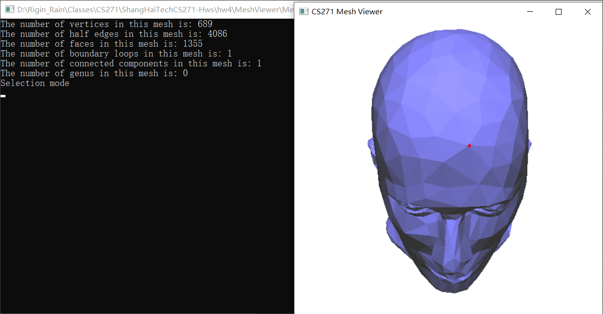
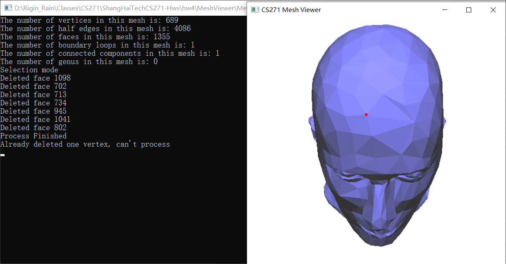
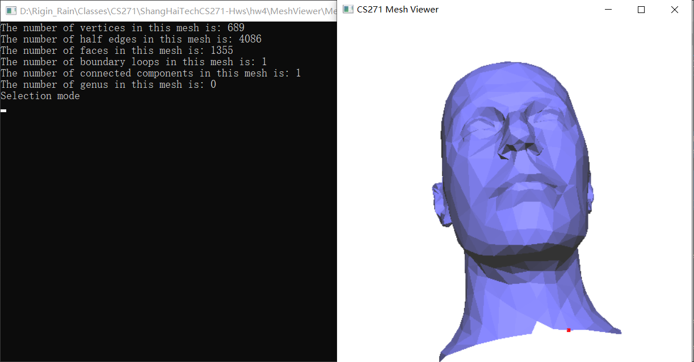
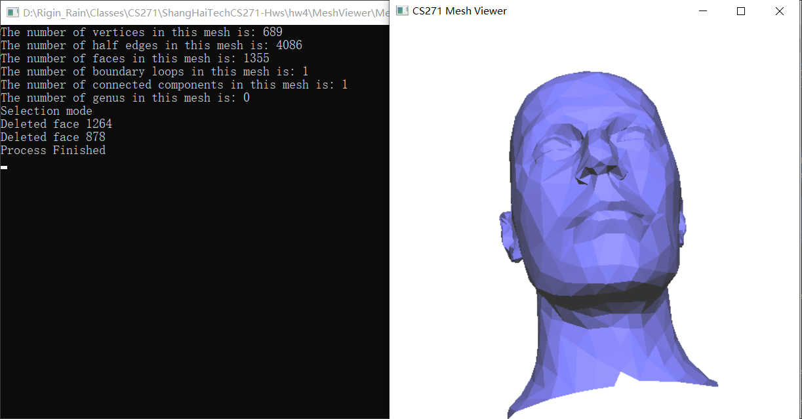
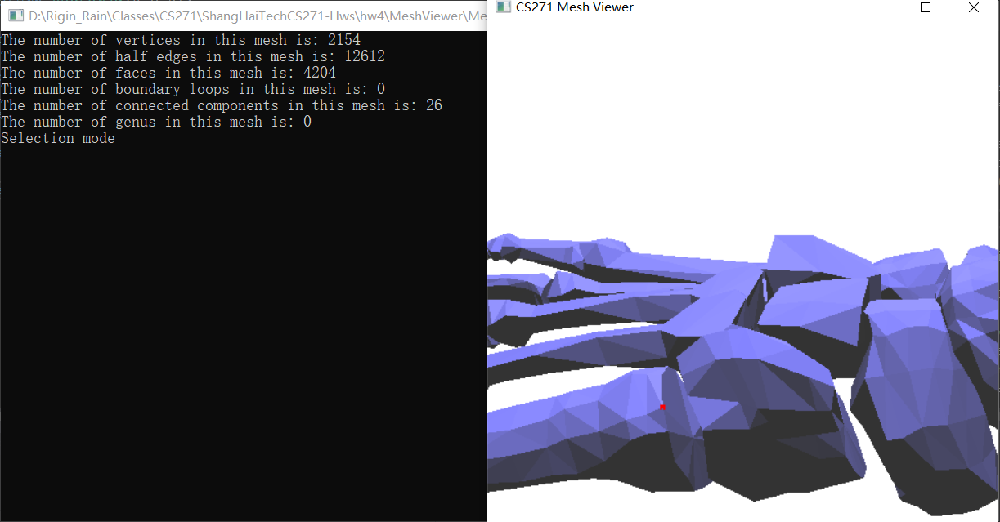
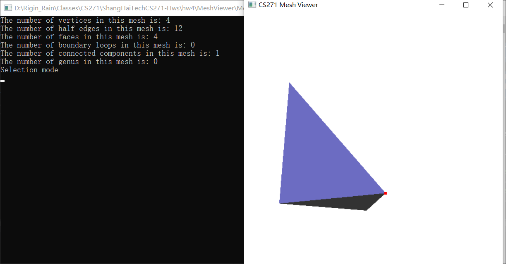
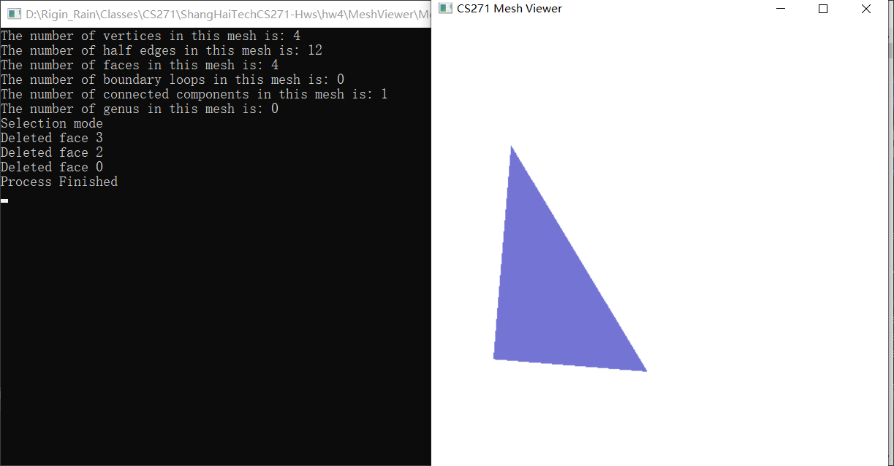

# CS271 Spring 2021 Computer Graphics II

# HomeWork 4

**Name:** **任怡静**

**Student ID:2018533144**

**E-mail: renyj@shanghaitech.edu.cn**

### Problem 1: Mesh Info Display

##### Package and Environment

- The convex hull algorithm is realized using language **C++**
- The project only uses the **GLUT** library as provided.
- Follow the instructions (https://piazza.com/class/kl8wmh1uda82ps?cid=29) on Piazza if **GULT** is not available on your computer

##### Instructions

- In **Project -> pa1 Properties... -> Debugging**, Set **Command Arguments** to `models\THE_OBJ_FILENAME`.
  - For example, if you want to check model **bu.obj**, simply write in `models\bu.obj`

##### Output

- It will output in console with **lines** of information of the mesh, containing the number of vertices, half-edges (including boundary edges and their twin edges), faces, boundary loops, genus and connected components.
- It will output a window displaying the mesh, drag left mouse button to rotate and hold on to middle mouse button and drag to scale.

##### Results(Some models are adjusted to have a better view)

- For atet.obj

- For bu.obj

- For bu_head.obj

- For cactus.obj

- For deo10k.obj

- For feline4k.obj

- For gbones.obj

- For mannequin.obj

- For skull.obj

- For sp.obj

- For sphere.obj

- For torus03.obj

### Problem 2: Delete a Vertex

##### Package and Environment

- The same as problem 1

##### Instructions

- Run the code as problem 1
- press **2** on keyboard to enter **Selection Mode**
- **Left click mouse button** to select one vertex in the display window, the selected vertex will show in red.
- Press **D** on keyboard to delete one vertex

##### Output

- The display window will show the result in real time.

##### Notice

- Since there is no maintenance in vertices' Indices, it is not recommended to delete another vertex.
- Due to not maintaining the vertices's Indices, the menu when right click the mouse is disabled if one vertex is deleted
- Sometimes if scale the view too close, the program will provide error, but this seems to be the bug of the template, just restart the program and be careful when scrolling view

##### Result

- Performance on ordinary non-bounding vertex
  - As the first two figures, you can see the vertex has been deleted and the layout of the face around the deleted vertex changes to fit the rules
  - The third and fourth picture shows that the program prohibits the second deletion, it also prevents some unintended triggering.

<figure class="half">
    
</figure>

- Performance on ordinary bounding vertex
- As in figures, the corresponding vertex has been deleted, you can see the tiny difference in the way the boundary edge goes

<figure class="half">
    

- Performance on non-bounding Edge vertex (sharp corners)
  - As you can see, even if deleting an sharp corner, the mending of the faces still performs good

<figure class="half">
    

