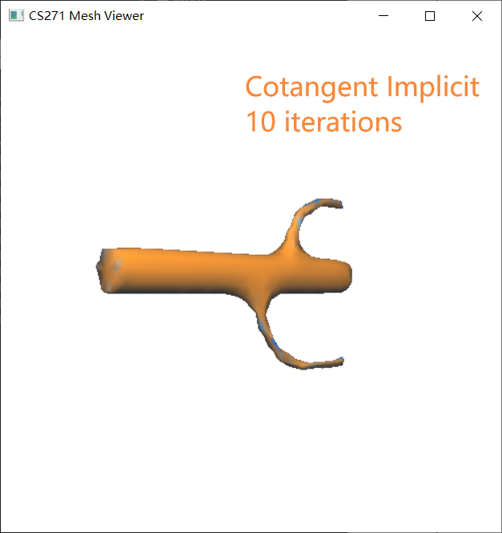

# CS271 Spring 2021 Computer Graphics II

# HomeWork 5

**Name:** **任怡静**

**Student ID:2018533144**

**E-mail: renyj@shanghaitech.edu.cn**

### Problem: Use Explicit and Implicit Laplacian method with Uniform weights and Cotangent weights, also show the point normals and curvatures

##### Package and Environment

- The algorithm is realized using language **C++**
- The project only uses the **GLUT** library as provided.
- Follow the instructions (https://piazza.com/class/kl8wmh1uda82ps?cid=29) on Piazza if **GULT** is not available on your computer

##### Instructions

- If you use command lines **(Windows Powershell recommended)**
  - First Enter the `BUILD_EXE` folder in the terminal window
  - then run the EXE with `.\pa1.exe ..\models\{THE_OBJ_FILENAME} {USE_UNIFORM_WEIGHT}`
  - (`./pa1.exe ../models/{THE_OBJ_FILENAME}` in Linux based system maybe, I haven't tried)
  - For example
    - if you want to check model **bu.obj** with uniform weight, simply type `.\pa1.exe ..\models\bu.obj m`
    - Or if you want to check model **bu.obj** with cotangent weight, simply type `.\pa1.exe ..\models\bu.obj`
  -  **Press "U" on keyboard for explicit smoothing, press "S" on keyboard for implicit smoothing, KEEP PRESSING UNTIL YOU FEEL SATISFIED WITH YOUR RESULT.**
  - Right click and choose the "**Display**" sub-menu, choose "**Color Smooth Shaded**" for colored mean curvature, choose "**Smooth Shaded**" for smooth shaded mode.
  
- If you use visual studio (2017) to open the pa1.sln

  - In **Project -> pa1 Properties... -> Debugging**, Set **Command Arguments** to `models\{THE_OBJ_FILENAME} {USE_UNIFORM_WEIGHT}`.                                         

  - For example

    - if you want to check model **bu.obj** with uniform weight, simply write  in`models\bu.obj m`
    - Or if you want to check model **bu.obj** with cotangent weight, simply write in`models\bu.obj`  
  
  - **Press "U" on keyboard for explicit smoothing, press "S" on keyboard for implicit smoothing, KEEP PRESSING UNTIL YOU FEEL SATISFIED WITH YOUR RESULT.**
  
  -  Right click and choose the "**Display**" sub-menu, choose "**Color Smooth Shaded**" for colored mean curvature, choose "**Smooth Shaded**" for smooth shaded mode.

##### Output

- It will output in console a line of code showing the required type of smoothing is finished.
- It will output a window displaying the mesh, drag left mouse button to rotate and hold on to middle mouse button and drag to scale. The good areas will be in blue, and the areas that are not so good will appear as blue. The curvature and normal are demostrated as the colors on the mesh.

##### Results(Just picked some obvious models for demostration)

- For bu.obj

  - Smooth shading mode and some comparison (**For neatness, the other meshes do not contain this part since this is clear enough**)

    - the **first** image is a **zoomed in** flat shaded image of the original mesh
    - the **second** image is the smooth(10) flat shaded image
    - the **third** image is the smooth(10) smooth shading mode
    - the **fourth** image is another angle of mesh of img3

    <figure class="half">
        
    
  - Explicit Smoothing with lambda = 0.5 (Left Uniform weight, right Cotangent weight)

    <figure class="half">
        

  - Implicit Smoothing with lambda = 0.5, iteration = 1 per BCG, tolerance 10% per BCG (Left Uniform weight, right Cotangent weight)

    <figure class="half">
        

- For cactus.obj

  - Explicit Smoothing with lambda = 0.5 (Left Uniform weight, right Cotangent weight)

    <figure class="half">
        

    <figure class="half">
        

  - Implicit Smoothing with lambda = 0.5, iteration = 1 per BCG, tolerance 10% per BCG (Left Uniform weight, right Cotangent weight)

    <figure class="half">
        

- For torus03.obj

  - Explicit Smoothing with lambda = 0.5 (Left Uniform weight, right Cotangent weight)

    <figure class="half">
        
    <figure class="half">
        

  - Implicit Smoothing with lambda = 0.5, iteration = 1 per BCG, tolerance 10% per BCG (Left Uniform weight, right Cotangent weight)
  
    <figure class="half">
        

##### Notice

- When using Cotangent weights, there will be some time that too many iterations of smoothing causing some of the vertices' coordinates to perform oddly, leading to face loss  and inversion of point normals, so try to limit the times of pressing "S" or "U" , or set **lambda** to smaller value so that you get the right result.

##### Conclusions

- From smoothing effect, in all, implicit performs better than explicit, cotangent performs better than uniform, thus it is usually cotangent implicit > cotangent explicit > uniform implicit > uniform explicit. BUT, if the mesh have some nasty faces in the beginning, like having very long sharp faces, the uniform performs better.

- From Similarity with original Models, the cotangent methods (implicit and explicit) outperforms the uniform methods (implicit and explicit).

- From stability, the mean methods (implicit and explicit) outperforms the cotangent methods (implicit and explicit), since cotangent weights may cause vertices exceeds other vertices around it and cause flip in normals and faces, causing faces to disappear.

  <figure class="half">
      

- From time, the explicit methods (uniform and cotangent) takes shorter time since it do not need to do loops to solve linear functions (uniform and cotangent).

- For parameter choices, choose lambda in range [0,1], the bigger lambda chooses, the faster the mesh shrinks. (NOTE THAT: large lambda do not guarantee good results). For maxIterCnt in BCG, although I set it to be 10, but usually it needs only 1 iteration to get the result. For tolerance in BCG, it seems 10% of the initial error is enough.

